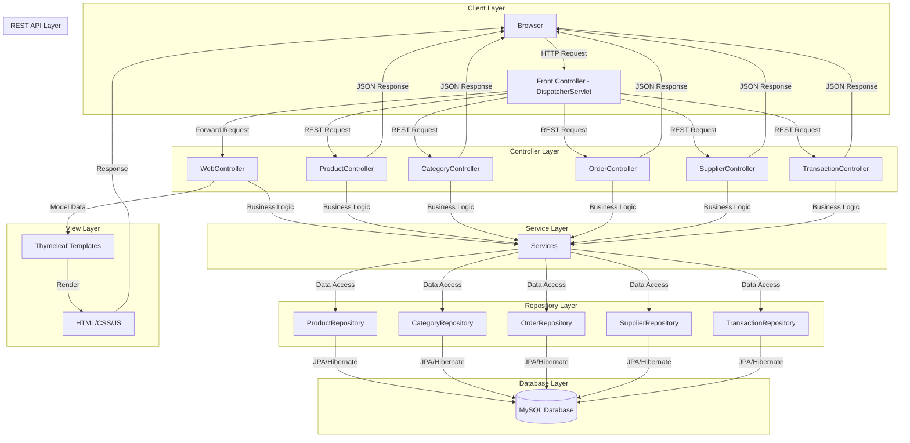
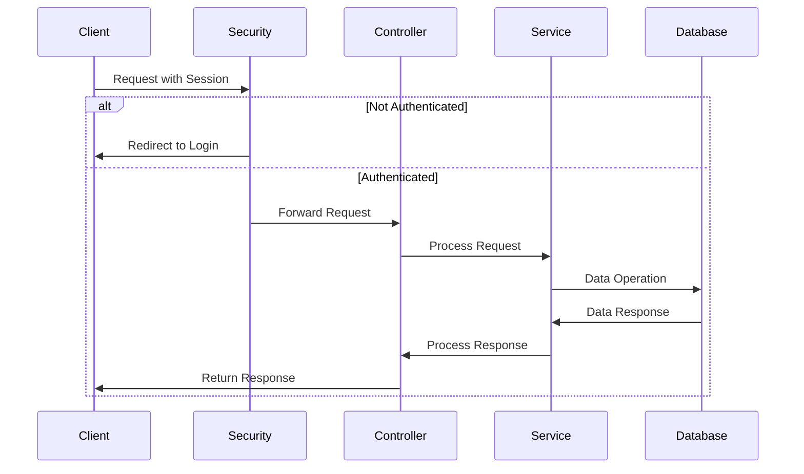
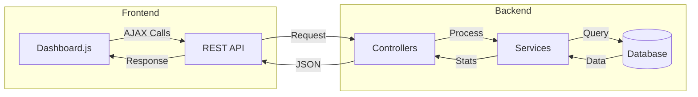

SpringWeb is a full-stack enterprise application built with Spring Boot 3.5.5 that combines modern web technologies with traditional business management needs. The system features a unique profile-based authentication system with visual user cards and provides comprehensive modules for managing products, orders, suppliers, transactions, and more.

### Unique Authentication System
- **Visual Profile Cards**: Users authenticate by selecting their profile card and entering a 2-digit access code
- **Secure Session Management**: Server-side session handling with automatic timeout
- **Khmer Language Support**: Full bilingual support with beautiful Khmer typography using Koh Santepheap font
- **No Traditional Passwords**: Simplified yet secure authentication approach

### Business Management Modules
- **Product Management**: Comprehensive inventory tracking with categories and suppliers
- **Order Processing**: Full order lifecycle management with status tracking
- **Supplier Management**: Vendor information and relationship management  
- **Financial Transactions**: Payment processing and transaction history
- **Category Management**: Product categorization and organization
- **Reporting System**: Business analytics and insights

### Modern UI/UX Design
- **Glassmorphism Interface**: Stunning glass-effect design with backdrop blur
- **Responsive Layout**: Optimized for desktop, tablet, and mobile devices
- **Emerald Green Theme**: Professional color scheme with subtle gradients
- **Material Design Icons**: Clean and consistent iconography
- **Smooth Animations**: Engaging micro-interactions and transitions

### Enterprise Architecture
- **RESTful API Design**: Clean separation between frontend and backend
- **JPA/Hibernate ORM**: Robust database abstraction layer
- **Spring Security Integration**: Built-in security features and CSRF protection
- **Thymeleaf Templates**: Server-side rendering with dynamic content
- **Modular Structure**: Scalable and maintainable codebase

## Application Architecture

### MVC Flow Diagram


### Data Flow Process
1. **Client Request**: Browser sends HTTP request (page load or AJAX)
2. **Front Controller**: DispatcherServlet receives and routes request
3. **Controller Processing**:
   - Web requests → WebController (Thymeleaf views)
   - API requests → REST Controllers (JSON responses)
4. **Service Layer**: Handles business logic and transactions
5. **Repository Layer**: Manages data access through JPA
6. **Database Layer**: Stores and retrieves data using MySQL
7. **Response Generation**:
   - Web pages: Thymeleaf templates render HTML
   - API calls: Controllers return JSON responses

### Security Flow


### Dashboard Data Flow


## API Reference

### Base URL
```
http://localhost:10000/api
```
### API Endpoints & Data Examples

#### Base URL
```
http://localhost:9999/api/v1
```

#### Dashboard Endpoints
```javascript
// Fetch Dashboard Stats
GET /api/v1/dashboard/stats
fetch('http://localhost:9999/api/v1/dashboard/stats')

// Example Response
{
    "totalSales": "១២៣,៤៥៦",
    "totalOrders": "២៣៤",
    "activeProducts": "៤៥៦",
    "recentTransactions": [
        {
            "id": "TR001",
            "amount": "១២០០៛",
            "date": "២០២៤-០១-១៥",
            "type": "ការលក់"
        }
    ]
}
```

#### Categories
```javascript
// Fetch Categories
GET /api/v1/categories
fetch('http://localhost:9999/api/v1/categories')

// Example Response
{
    "categories": [
        {
            "id": "CAT001",
            "name": "បង្អែម",
            "description": "នំគ្រប់ប្រភេទ"
        },
        {
            "id": "CAT002", 
            "name": "ភេសជ្ជៈ",
            "description": "ទឹកដបគ្រប់ប្រភេទ"
        },
        {
            "id": "CAT003",
            "name": "ម្ហូបអាហារ",
            "description": "អាហារគ្រប់មុខ"
        }
    ]
}
```

#### Suppliers 
```javascript
// Fetch Suppliers
GET /api/v1/suppliers
fetch('http://localhost:9999/api/v1/suppliers')

// Example Response
{
    "suppliers": [
        {
            "id": "SUP001",
            "name": "ក្រុមហ៊ុន កសិផល",
            "contact": "០២៣ ២៣៤ ៥៦៧",
            "address": "ផ្សារថ្មី"
        },
        {
            "id": "SUP002",
            "name": "អ្នកស្រី សុខា",  
            "contact": "០១២ ៣៤៥ ៦៧៨",
            "address": "ទួលគោក"
        }
    ]
}
```

#### Products
```javascript
// Fetch Products
GET /api/v1/products
fetch('http://localhost:9999/api/v1/products')

// Example Response
{
    "products": [
        {
            "id": "PRD001", 
            "name": "បាយដំណើប",
            "price": "២០០០៛",
            "stock": "៥០"
        },
        {
            "id": "PRD002",
            "name": "នំបញ្ចុក",
            "price": "៣០០០៛", 
            "stock": "៣០"
        }
    ]
}
```

#### Orders
```javascript
// Fetch Orders
GET /api/v1/orders
fetch('http://localhost:9999/api/v1/orders')

// Example Response
{
    "orders": [
        {
            "id": "ORD001",
            "customer": "សុខា",
            "total": "៥០០០០៛",
            "status": "បញ្ចប់"
        },
        {
            "id": "ORD002",
            "customer": "វណ្ណា",
            "total": "៣០០០០៛",
            "status": "កំពុងដឹក"
        }
    ]
}
```

#### Users
```javascript
// Fetch Users
GET /api/v1/users
fetch('http://localhost:9999/api/v1/users')

// Example Response
{
    "users": [
        {
            "id": "USR001",
            "name": "សុខា",
            "role": "អ្នកគ្រប់គ្រង",
            "status": "សកម្ម"
        },
        {
            "id": "USR002",
            "name": "វណ្ណា",
            "role": "អ្នកលក់",
            "status": "សកម្ម"
        }
    ]
}
```

#### Transactions
```javascript
// Fetch Transactions
GET /api/v1/transactions
fetch('http://localhost:9999/api/v1/transactions')

// Example Response
{
    "transactions": [
        {
            "id": "TRX001",
            "type": "ការលក់",
            "amount": "១២០០០៛",
            "date": "២០២៤-០១-១៥"
        },
        {
            "id": "TRX002", 
            "type": "ការទិញ",
            "amount": "៥០០០០៛",
            "date": "២០២៤-០១-១៤"
        }
    ]
}
```

#### Reports
```javascript
// Fetch Reports
GET /api/v1/reports/{type}
fetch('http://localhost:9999/api/v1/reports/sales')

// Example Response
{
    "reportType": "របាយការណ៍លក់",
    "period": "ខែមករា ២០២៤",
    "data": [
        {
            "date": "២០២៤-០១-១៥",
            "sales": "១២០០០០៛",
            "items": "២០"
        }
    ]
}
```

#### Settings
```javascript
// Fetch Settings
GET /api/v1/settings
fetch('http://localhost:9999/api/v1/settings')

// Example Response
{
    "settings": {
        "companyName": "ហាងលក់ទំនិញ",
        "phone": "០២៣ ២៣៤ ៥៦៧",
        "address": "ភ្នំពេញ",
        "currency": "រៀល",
        "language": "ខ្មែរ"
    }
}
```


### HTTP Status Codes
- 200: Successful operation
- 401: Authentication required
- 403: Access forbidden
- 404: Resource not found
- 500: Server error

### Prerequisites
Before running the application, ensure you have:
- Java 21 or higher installed
- Maven 3.6+ (or use included wrapper)
- Git for version control
- MySQL Server 8.0+ (optional, H2 available for development)
- Modern web browser (Chrome, Firefox, Safari, Edge)

### Quick Start Guide 🚀

1. **Clone the Repository**
   ```bash
   git clone https://github.com/yourusername/SpringWeb.git
   cd SpringWeb
   ```

2. **Configure Database**
   - Create MySQL database:
     ```sql
     CREATE DATABASE java_spring_boot_db;
     ```
   - Update `application.properties` with your database credentials:
     ```properties
     spring.datasource.url=jdbc:mysql://localhost:3306/java_spring_boot_db
     spring.datasource.username=your_username
     spring.datasource.password=your_password
     ```

3. **Build and Run**
   ```bash
   # Using Maven Wrapper
   ./mvnw clean install
   ./mvnw spring-boot:run

   # Or using installed Maven
   mvn clean install
   mvn spring-boot:run
   ```

4. **Access the Application**
   - Open your browser and navigate to: `http://localhost:10000`
   - Default credentials will be displayed on the login page


netsh advfirewall firewall add rule name="SpringBoot8084" dir=in action=allow protocol=TCP localport=8084


### Main Navigation Menu

> Each menu item uses Material Icons and provides quick access to core modules.

- **Logo**: 
    - Company/application branding element
    - Acts as a home button/link

- **Dashboard** `dashboard`:
    - Main overview screen
    - Shows key metrics and analytics  
    - First screen after login

- **Categories** `local_offer`:
    - Manage product categories
    - Organize products into groups
    - Tag and classify items

- **Suppliers** `local_shipping`:
    - Manage vendor information
    - Track supplier relationships
    - Handle supplier contracts

- **Products** `inventory_2`:
    - Manage product catalog
    - Track inventory levels
    - Handle product details

- **Orders** `shopping_cart`:
    - Process customer orders
    - Track order status
    - Manage fulfillment

- **Transactions** `credit_card`:
    - Track payment records
    - Monitor financials
    - Handle payments

- **Reports** `bar_chart`:
    - Generate business reports
    - View analytics/trends
    - Export data

- **Settings** `settings`:
    - System configuration
    - User preferences
    - Application settings


## Technology Stack

### Backend Technologies
- **Framework**: Spring Boot 3.5.5
- **Java Version**: Java 21 (LTS)
- **Database**: MySQL 8.0+ / H2 (development)
- **ORM**: Hibernate 6.6.26 with JPA
- **Template Engine**: Thymeleaf
- **Build Tool**: Maven 3.6+
- **Application Server**: Embedded Tomcat 10.1.44

### Frontend Technologies  
- **Languages**: HTML5, CSS3, JavaScript (ES6+)
- **Styling**: Custom CSS with CSS Grid and Flexbox
- **Fonts**: Google Fonts (Ubuntu, Koh Santepheap)
- **Icons**: Material Icons + Font Awesome
- **UI Framework**: Custom glassmorphism components

### Development Tools
- **IDE**: Compatible with IntelliJ IDEA, Eclipse, VS Code
- **Version Control**: Git
- **Package Management**: Maven Central Repository
- **Testing**: JUnit 5, Spring Boot Test


## Business Modules & Features

### Dashboard Overview
- **Real-time Statistics**: Key performance indicators and metrics
  - Total products, orders, and revenue tracking
  - Category-wise product distribution
  - Stock status and low stock alerts
  - Revenue analysis with trends
- **Interactive Charts**: Beautiful visualizations using Chart.js
  - Revenue line graph with total and net revenue
  - Category distribution pie chart
  - Stock status bar chart
  - Transaction type and payment method analysis
- **User Welcome**: Personalized greeting in both English and Khmer
- **Quick Actions**: Direct access to frequently used features
- **System Status**: Server health and database connection status
- **Real-time Updates**: Dynamic data refresh without page reload

### Recent Updates (September 2025)
- Added comprehensive dashboard with real-time analytics
- Implemented automatic invoice generation for orders
- Enhanced stock management with low stock alerts
- Added support for multiple payment methods
- Improved transaction tracking and reporting
- Enhanced UI with responsive design and better user experience

### Product Management
- **Inventory Tracking**: Real-time stock levels and alerts
- **Category Organization**: Hierarchical product categorization  
- **Supplier Integration**: Link products to suppliers
- **Price Management**: Dynamic pricing with history tracking
- **Bulk Operations**: Import/export product data

### Order Processing
- **Order Lifecycle**: From creation to delivery tracking
- **Customer Management**: Customer information and history
- **Order Status Tracking**: Real-time status updates
- **Invoice Generation**: Automated invoice creation
- **Payment Integration**: Multiple payment method support

### Supplier Management
- **Vendor Database**: Complete supplier information
- **Contact Management**: Multiple contact persons per supplier
- **Performance Tracking**: Supplier rating and history
- **Purchase Orders**: Automated PO generation
- **Communication Log**: Interaction history tracking

### Financial Transactions
- **Payment Processing**: Multiple payment methods
- **Transaction History**: Complete audit trail
- **Refund Management**: Easy refund processing
- **Financial Reporting**: Revenue and expense tracking
- **Tax Management**: Tax calculation and reporting

### Reporting & Analytics
- **Sales Reports**: Detailed sales analytics
- **Inventory Reports**: Stock levels and movement
- **Financial Reports**: Profit/loss statements
- **User Activity**: System usage analytics
- **Export Capabilities**: PDF, Excel, CSV exports

## Security & Authentication

### Profile-Based Authentication
- **Visual Authentication**: Select profile card instead of typing username
- **2-Digit Access Codes**: Simple yet secure authentication
- **Session Management**: Automatic session timeout and renewal
- **CSRF Protection**: Built-in cross-site request forgery protection
- **XSS Prevention**: Input sanitization and output encoding

### Data Security
- **SQL Injection Prevention**: Parameterized queries with JPA
- **Input Validation**: Server-side validation for all inputs
- **Secure Headers**: HTTP security headers implementation
- **Audit Trail**: Complete user action logging
- **Data Encryption**: Sensitive data encryption at rest

### Access Control
- **Role-Based Access**: Different access levels per user
- **Module Permissions**: Granular permission system
- **Session Security**: Secure session token management
- **Failed Login Protection**: Account lockout after failed attempts

